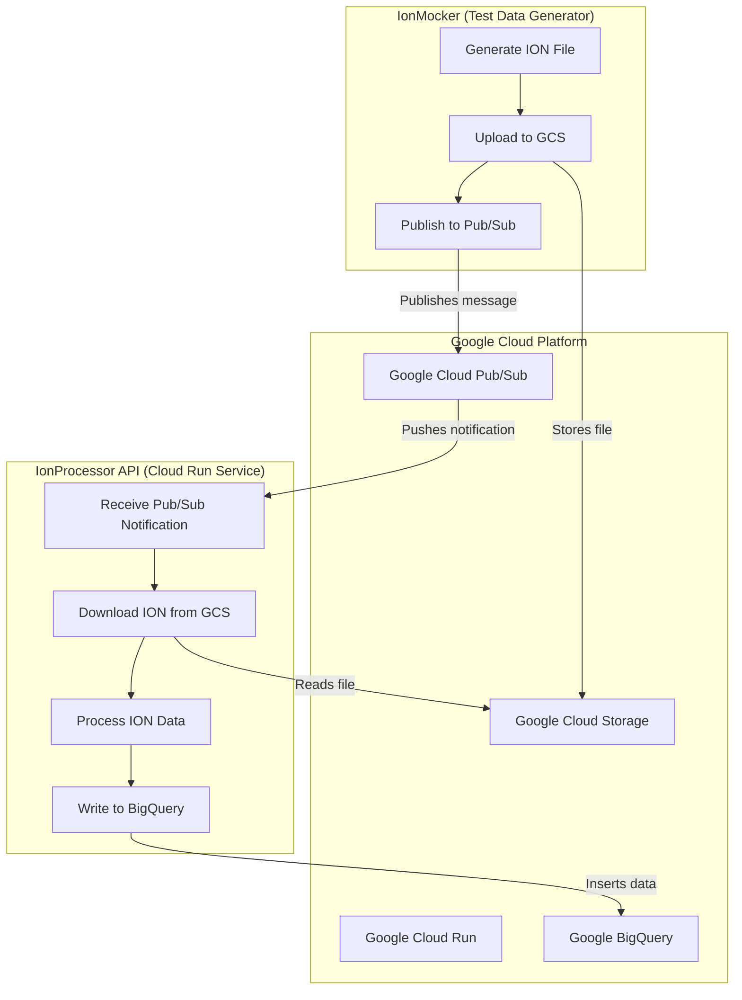
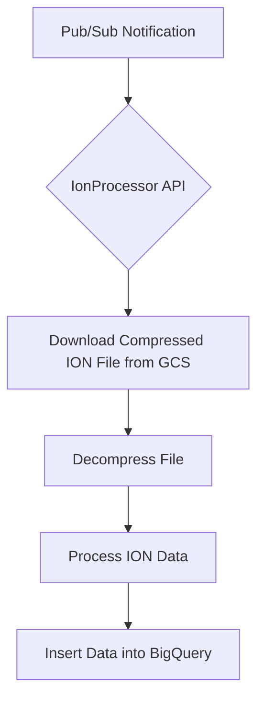

# Ion Processor

This project is a .NET Web API designed to process binary ION files from Google Cloud Storage and load their contents into Google BigQuery. It is designed to be deployed as a container on Google Cloud Run and triggered by push notifications from Google Cloud Pub/Sub.

## Application Architecture

The following diagram illustrates the end-to-end workflow, from data generation by the `IonMocker` to final processing by the `IonProcessor`.



## Project Overview

The workflow is as follows:



1.  A message is published to a Pub/Sub topic. The message contains the bucket and object name of an ION file in Google Cloud Storage.
2.  Pub/Sub sends a push notification to the `/PubSub` endpoint of this Web API.
3.  The API receives the notification, downloads the specified ION file from Google Cloud Storage.
4.  The downloaded file is then decompressed (the specific algorithm is pending).
5.  It reads the binary ION data using the [ion-dotnet](https://github.com/amazon-ion/ion-dotnet) library.
6.  The processed data is then written to a specified table in Google BigQuery.
7.  The API sends an HTTP `200 OK` status code to acknowledge the Pub/Sub message, indicating successful processing. If processing fails, it returns an HTTP `500` status code, which signals Pub/Sub to nack (negatively acknowledge) the message, allowing for retries or dead-lettering.

## Message Acknowledgement and Retries

This service is designed to be highly reliable by correctly integrating with Google Cloud Pub/Sub's message acknowledgement and retry mechanisms.

### Acknowledgement (ACK)

When the API successfully processes a message from start to finish (download, decompress, process, and insert into BigQuery), it returns an **HTTP `200 OK`** status code. This serves as an **acknowledgement (ACK)** to Pub/Sub, signaling that the message has been successfully handled and should be discarded.

### Negative Acknowledgement (NACK) and Retries

If any step in the processing pipeline fails, the API returns an **HTTP `500 Internal Server Error`** status code. Pub/Sub treats this response (along with other non-success codes) as a **negative acknowledgement (NACK)**.

When Pub/Sub receives a NACK, it will automatically attempt to **redeliver the message** based on the subscription's configured retry policy. This is crucial for handling transient errors, such as temporary network issues or brief service unavailability. If the `IonProcessor` is deployed as a scalable Cloud Run service, the retry might be handled by a different, healthy instance.

### Dead-Lettering for Persistent Failures

For messages that repeatedly fail processing (e.g., due to a malformed ION file or a persistent external service outage), it is critical to configure a **dead-letter topic (DLQ)** on the Pub/Sub subscription. After a configured number of failed delivery attempts, Pub/Sub will move the "poison pill" message to the DLQ. This prevents the message from being retried indefinitely and allows developers to inspect and debug the failed message without disrupting the main processing pipeline.

This ACK/NACK/Retry/DLQ pattern is fundamental to building a robust and resilient data processing system.

## Technologies Used

*   .NET 8
*   ASP.NET Core Web API
*   [Amazon.IonDotnet](https://github.com/amazon-ion/ion-dotnet)
*   Google Cloud Services:
    *   Cloud Run
    *   Pub/Sub
    *   Cloud Storage
    *   BigQuery
*   Docker

## Configuration

### IonProcessor

Before running the application, you must configure your Google Cloud settings in `IonProcessor/appsettings.json`:

```json
{
  "GoogleCloud": {
    "ProjectId": "your-gcp-project-id",
    "DatasetId": "your-dataset-id",
    "TableId": "your-table-id"
  }
}
```

Replace the placeholder values with your actual GCP Project ID, BigQuery Dataset ID, and BigQuery Table ID.

### IonMocker

The `IonMocker` is a console application used for generating test data. You must configure the GCP settings directly in `IonMocker/Program.cs`:

```csharp
var projectId = "your-gcp-project-id";
var bucketName = "your-gcs-bucket-name";
var topicId = "your-pubsub-topic-id";
```

Replace the placeholder values with your actual GCP Project ID, GCS Bucket Name, and Pub/Sub Topic ID.

## Pub/Sub Configuration

To ensure a robust and reliable system, it is critical to configure both the main Pub/Sub topic and a dead-letter topic. The following instructions use the `gcloud` command-line tool.

### 1. Create the Main Topic

This is the topic where your `IonMocker` will publish messages.

```bash
gcloud pubsub topics create your-main-topic-id
```

### 2. Create the Dead-Letter Topic

This topic will receive messages that fail processing repeatedly.

```bash
gcloud pubsub topics create your-dead-letter-topic-id
```

### 3. Create the Push Subscription

This command creates the subscription that will push messages to your deployed Cloud Run service. It includes the critical dead-lettering configuration.

Replace the following placeholders:
*   `your-subscription-id`: A unique name for your subscription.
*   `your-main-topic-id`: The ID of the main topic you created in step 1.
*   `your-cloud-run-service-url`: The URL of your deployed `IonProcessor` service.
*   `your-dead-letter-topic-id`: The ID of the dead-letter topic you created in step 2.
*   `5`: The maximum number of delivery attempts before a message is sent to the dead-letter topic. You can adjust this value to suit your needs.

```bash
gcloud pubsub subscriptions create your-subscription-id \
  --topic=your-main-topic-id \
  --push-endpoint=your-cloud-run-service-url/PubSub \
  --dead-letter-topic=your-dead-letter-topic-id \
  --max-delivery-attempts=5
```

**Important:** The Pub/Sub service account requires permissions to publish to the dead-letter topic. When you configure dead-lettering with `gcloud` as shown above, Google Cloud will automatically grant the necessary `pubsub.publisher` role to the service account.

## Deployment

This project uses a two-stage deployment process that separates infrastructure provisioning from application deployment.

1.  **Infrastructure Deployment with Terraform:** Creates all the necessary Google Cloud resources (Artifact Registry, Cloud Run, Pub/Sub, etc.).
2.  **Application Deployment with Cloud Build:** Builds the application container, pushes it to Artifact Registry, and deploys it to the Cloud Run service.

### Prerequisites

*   [Google Cloud SDK](https://cloud.google.com/sdk/docs/install) installed and authenticated.
*   [Terraform](https://learn.hashicorp.com/tutorials/terraform/install-cli) installed.
*   The required Google Cloud APIs have been enabled for your project (this is handled by the Terraform script).

### Step 1: Deploy the Infrastructure

The Terraform scripts in the `terraform/` directory will provision all the necessary cloud resources.

1.  **Navigate to the Terraform directory:**
    ```bash
    cd terraform
    ```

2.  **Create a `terraform.tfvars` file:**
    This file will contain the specific values for your environment. Create a file named `terraform.tfvars` and add the following content, replacing the placeholder values with your own:

    ```hcl
    project_id          = "your-gcp-project-id"
    region              = "your-gcp-region" # e.g., "us-central1"
    service_name        = "ion-processor"
    gcs_bucket_name     = "your-unique-gcs-bucket-name"
    bigquery_dataset_id = "your_bigquery_dataset"
    bigquery_table_id   = "your_bigquery_table"
    ```

3.  **Initialize Terraform:**
    ```bash
    terraform init
    ```

4.  **Apply the Terraform configuration:**
    Review the plan and, if it looks correct, type `yes` to proceed.
    ```bash
    terraform apply
    ```

This will create an Artifact Registry repository, a GCS bucket, Pub/Sub topics, and a Cloud Run service (initially deployed with a public placeholder image).

### Step 2: Build and Deploy the Application

Once the infrastructure is in place, you can deploy the `IonProcessor` application using Cloud Build.

1.  **Navigate to the root directory of the project.**

2.  **Submit the build to Cloud Build:**
    This command uses the `cloudbuild.yaml` file to build, push, and deploy your service. Make sure the `_REPO_NAME` and `_REGION` variables match what you defined in your `terraform.tfvars` file.

    ```bash
    gcloud builds submit --config cloudbuild.yaml \
      --substitutions=_SERVICE_NAME="ion-processor",_REPO_NAME="ion-processor-repo",_REGION="us-central1"
    ```

Cloud Build will now execute the steps defined in `cloudbuild.yaml`:
1.  Build the Docker image.
2.  Push the image to your Artifact Registry repository.
3.  Deploy the new image to your Cloud Run service, replacing the placeholder.

Your `IonProcessor` is now live and ready to receive Pub/Sub notifications.


## Running the Solution

### Running the Test Data Generator

To generate a new test file, upload it to GCS, and send a Pub/Sub notification, run the `IonMocker` project:

```bash
dotnet run --project IonMocker
```

### Running the Unit Tests

The project includes a suite of unit tests to ensure the correctness of the application logic. To run the tests, navigate to the root directory of the project and run the following command:

```bash
dotnet test
```

