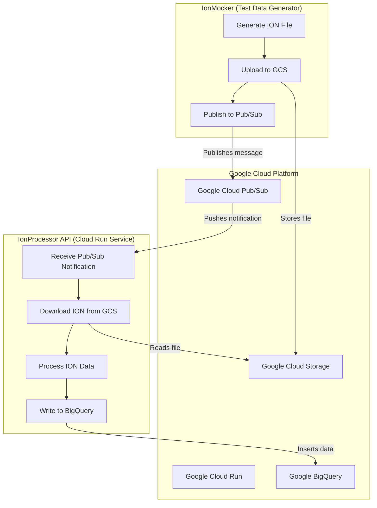

# Ion Processor

This project is a .NET Web API designed to process binary ION files from Google Cloud Storage and load their contents into Google BigQuery. It is designed to be deployed as a container on Google Cloud Run and triggered by push notifications from Google Cloud Pub/Sub.

## Application Architecture

The following diagram illustrates the end-to-end workflow, from data generation by the `IonMocker` to final processing by the `IonProcessor`.



## Project Overview

The workflow is as follows:

1.  A message is published to a Pub/Sub topic. The message contains the bucket and object name of an ION file in Google Cloud Storage.
2.  Pub/Sub sends a push notification to the `/PubSub` endpoint of this Web API.
3.  The API receives the notification, downloads the specified ION file from Google Cloud Storage.
4.  The downloaded file is then decompressed (the specific algorithm is pending).
5.  It reads the binary ION data using the [ion-dotnet](https://github.com/amazon-ion/ion-dotnet) library.
6.  The processed data is then written to a specified table in Google BigQuery.
7.  The API sends an HTTP `200 OK` status code to acknowledge the Pub/Sub message, indicating successful processing. If processing fails, it returns an HTTP `500` status code, which signals Pub/Sub to nack (negatively acknowledge) the message, allowing for retries or dead-lettering.

## Technologies Used

*   .NET 8
*   ASP.NET Core Web API
*   [Amazon.IonDotnet](https://github.com/amazon-ion/ion-dotnet)
*   Google Cloud Services:
    *   Cloud Run
    *   Pub/Sub
    *   Cloud Storage
    *   BigQuery
*   Docker

## Configuration

### IonProcessor

Before running the application, you must configure your Google Cloud settings in `IonProcessor/appsettings.json`:

```json
{
  "GoogleCloud": {
    "ProjectId": "your-gcp-project-id",
    "DatasetId": "your-dataset-id",
    "TableId": "your-table-id"
  }
}
```

Replace the placeholder values with your actual GCP Project ID, BigQuery Dataset ID, and BigQuery Table ID.

### IonMocker

The `IonMocker` is a console application used for generating test data. You must configure the GCP settings directly in `IonMocker/Program.cs`:

```csharp
var projectId = "your-gcp-project-id";
var bucketName = "your-gcs-bucket-name";
var topicId = "your-pubsub-topic-id";
```

Replace the placeholder values with your actual GCP Project ID, GCS Bucket Name, and Pub/Sub Topic ID.

## Deployment to Google Cloud Run

The `IonProcessor` application is designed to be deployed as a container.

### Prerequisites

*   [Google Cloud SDK](https://cloud.google.com/sdk/docs/install) installed and configured.
*   [Docker](https://docs.docker.com/get-docker/) installed.

### Steps

1.  **Build the Docker image:**
    Open a terminal in the root directory of the project (the one containing the `Dockerfile`) and run the following command. Replace `your-gcp-project-id` with your actual GCP Project ID.

    ```bash
    docker build -t gcr.io/your-gcp-project-id/ion-processor .
    ```

2.  **Push the image to Google Container Registry (GCR):**

    ```bash
    docker push gcr.io/your-gcp-project-id/ion-processor
    ```

3.  **Deploy the image to Cloud Run:**

    ```bash
    gcloud run deploy ion-processor \
      --image gcr.io/your-gcp-project-id/ion-processor \
      --platform managed \
      --region your-gcp-region # e.g., us-central1
    ```
    This command will deploy the container and provide you with a URL for the service. You will use this URL to configure your Pub/Sub push subscription.

## Running the Solution

### Running the Test Data Generator

To generate a new test file, upload it to GCS, and send a Pub/Sub notification, run the `IonMocker` project:

```bash
dotnet run --project IonMocker
```

### Running the Unit Tests

The project includes a suite of unit tests to ensure the correctness of the application logic. To run the tests, navigate to the root directory of the project and run the following command:

```bash
dotnet test
```

